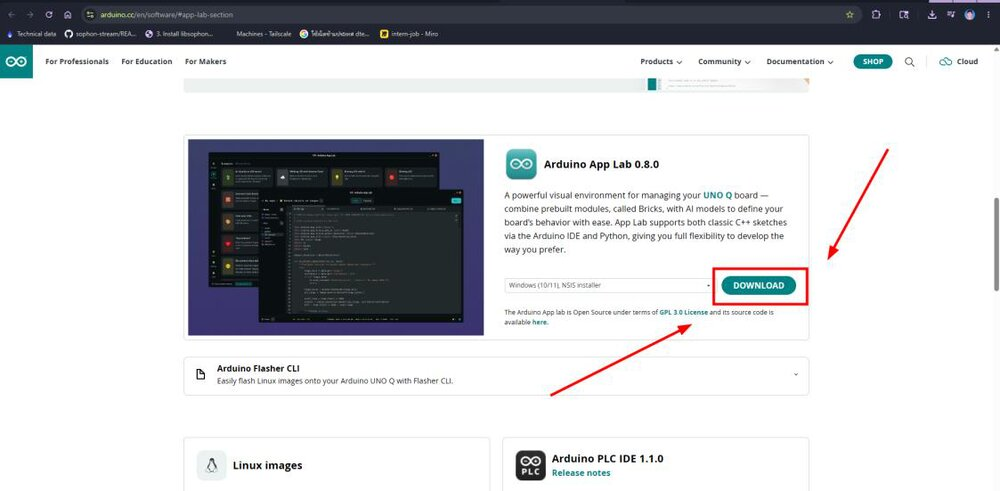
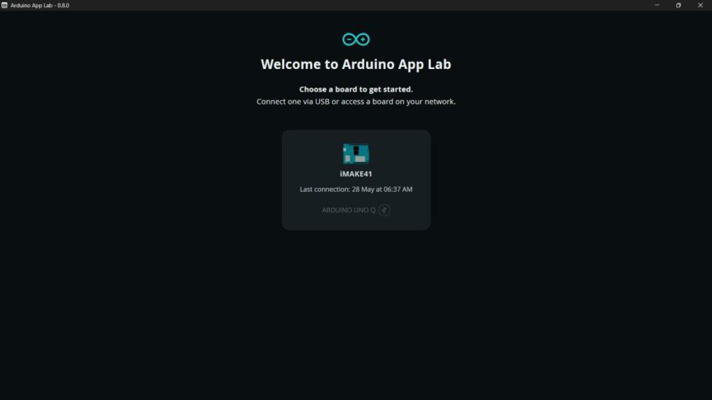

<!-- workshop-header -->

# 💻 ติดตั้ง Arduino App Lab

App Lab คือโปรแกรมบน laptop ที่ใช้คุม UNO Q ทั้งวัน — **ลงให้เสร็จก่อนเริ่ม** (พี่เลี้ยงอาจลงไว้ให้แล้ว เช็กว่ามีไอคอนหรือยัง)

> ทำครั้งเดียวต่อเครื่อง · ใช้ได้ทั้ง Windows / macOS

---

## 1) ดาวน์โหลด

เข้า [arduino.cc/en/software → App Lab](https://www.arduino.cc/en/software/#app-lab-section) → กด **DOWNLOAD** (เลือกให้ตรง OS ของเครื่อง)

---

## 2) ติดตั้ง

เปิดไฟล์ที่โหลดมาใน **Downloads** แล้วติดตั้งตามปกติ (กด Next ไปเรื่อยๆ)

---

## 3) เปิดโปรแกรม → เสียบบอร์ด

เปิด App Lab ครั้งแรกจะขึ้น **"No boards found"** — ปกติ ยังไม่ได้เสียบบอร์ด

เสียบ UNO Q ด้วย USB-C รอ ~30–60 วินาที แล้วบอร์ดจะโผล่มาให้ **Choose a board**

> ✅ **ผ่านเมื่อ:** เปิด App Lab แล้วเห็นบอร์ด UNO Q ขึ้นมาให้เลือก

บอร์ดไม่ขึ้น? → [troubleshooting.md](troubleshooting.md) ข้อ 1

ต่อไป → [02-setup-board.md](02-setup-board.md) ตั้งบอร์ดให้เป็นของทีม
