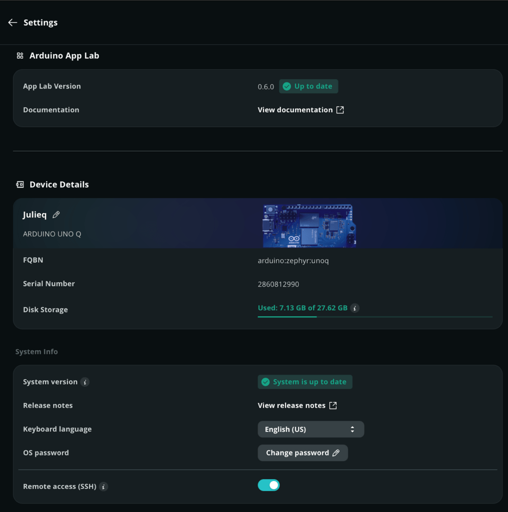
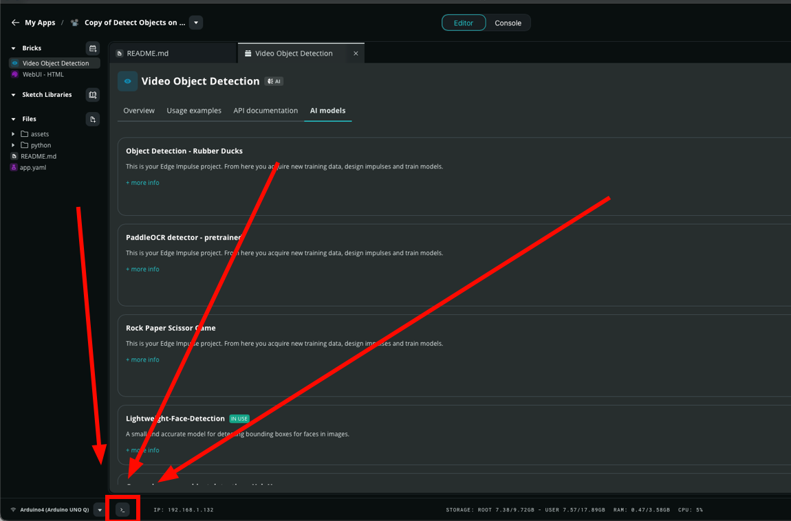

<!-- workshop-header -->

# 🔧 ตั้งบอร์ดให้เป็นของทีม

บอร์ดที่ได้มาเคยมีคนอื่นใช้ — รหัส / ชื่อ / Wi-Fi เดิมไม่ใช่ของเรา เราจะตั้งใหม่ให้เป็นของทีม **ไม่ต้อง flash ใหม่**

## ขั้นตอน

1. เสียบ USB-C เข้าบอร์ด + laptop รอ ~30–60 วินาทีให้ boot
2. เปิด **Arduino App Lab** รอจนเห็นบอร์ด แล้วคลิกเชื่อม (App Lab จะ login เข้าบอร์ดให้เอง แม้ไม่รู้รหัสเดิม)
3. ไปที่ **Settings** ของบอร์ด แล้วตั้ง 3 อย่าง:
   - **ชื่อบอร์ด** (ไอคอนดินสอข้าง device name) → `team-XX-q` (XX = เลขทีม)
   - **OS password** → กด *Change password* ตั้งรหัสของทีม แล้ว **จดไว้** (บ่าย/พรุ่งนี้อาจต้องใช้)
   - **Wi-Fi** (เลื่อนลงล่างเจอ SSID / PASSWORD) → ตั้งให้ตรงกับ Wi-Fi ที่ laptop ใช้
4. เปิด **Remote access (SSH)** ไว้

> ✅ **ผ่านเมื่อ:** App Lab เห็นบอร์ดชื่อ `team-XX-q` + ต่อ Wi-Fi ได้ + ทีมรู้รหัสตัวเอง

## เกร็ด

- บอร์ดกับ laptop ต้องอยู่ **Wi-Fi ตัวเดียวกัน** ไม่งั้น App Lab หาบอร์ดไม่เจอ
- เปิด shell บนบอร์ดได้จากปุ่ม **`>_`** มุมล่างซ้ายของ App Lab (ไว้ใช้ตอนบ่าย)

บอร์ดไม่ขึ้น / ไม่ boot? เปิด [troubleshooting.md](troubleshooting.md) ข้อ 1
