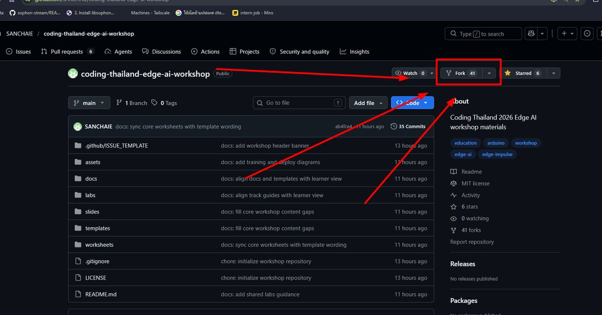
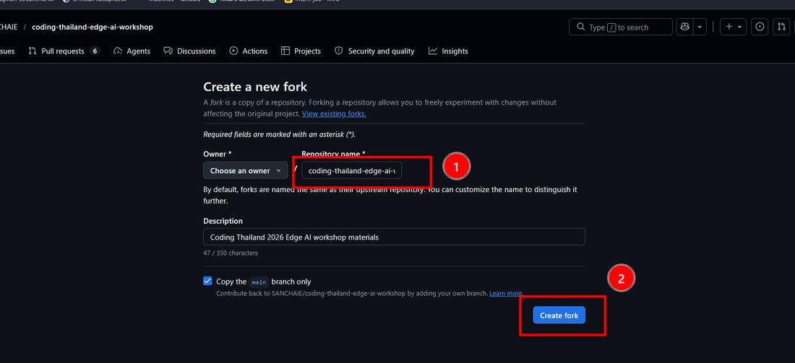
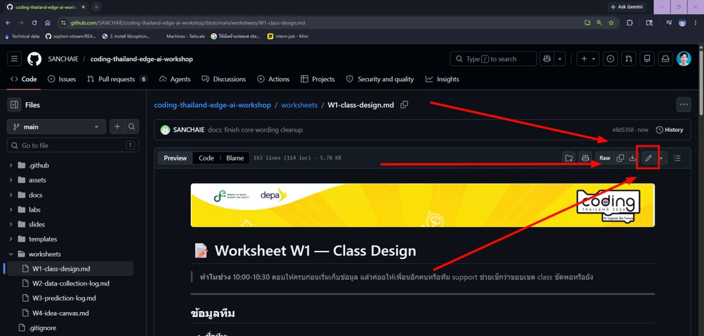
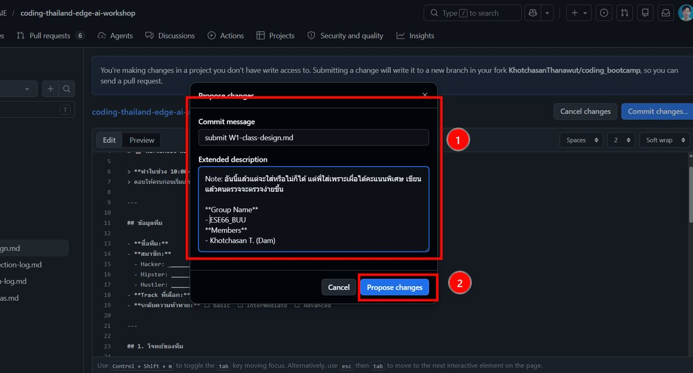
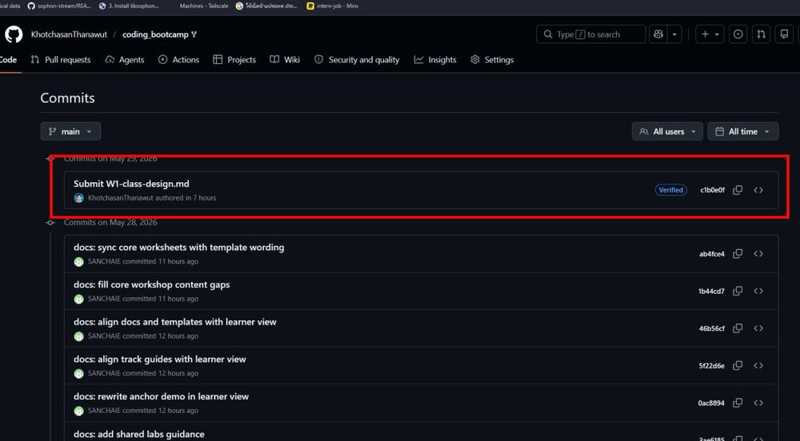

<!-- workshop-header -->

# 📤 ส่งงานผ่าน Fork

วันแรกใช้ git แค่ "ส่งงาน" พอ ทำผ่านเว็บ GitHub ได้หมด ไม่ต้อง clone

## 1) Fork repo (ครั้งเดียวต่อทีม)

1. เข้า repo หลัก กด **Fork** (มุมขวาบน)

2. ตั้งชื่อ repo → **Create fork**

3. ถ้ากด Fork แล้ว error = เคย fork แล้ว → กดโลโก้ GitHub ไป dashboard หา repo เดิมที่สร้างไว้

> ⚠️ ก่อนแก้ทุกครั้ง เช็กว่าอยู่ใน repo **ของทีมเอง** ไม่ใช่ repo หลัก ไม่งั้น commit ผิดที่

## 2) แก้ + commit

1. เปิดไฟล์ที่จะกรอก (เช่น `team-template/afternoon/model.md`) → กด **ไอคอนดินสอ**

2. กรอกเนื้อหา → กด **Commit changes**
3. ใส่ข้อความสั้นๆ + ชื่อทีม/สมาชิก → **Propose changes**

## 3) เช็กว่าส่งแล้ว

กดชื่อ repo ทีม → แท็บ **Commits** → เห็น commit ของทีมโผล่ = อัปเดตแล้ว

## ต้องส่งให้ครบ

- [ ] `team-template/morning/hardware-check.md` — input 3 ตัว + รูป
- [ ] `team-template/afternoon/model.md` — EI link + accuracy + confusion matrix
- [ ] `team-template/afternoon/predictions.csv` — ≥10 cases
- [ ] รูป/คลิป model รันบนบอร์ด ใน `team-template/assets/`
- [ ] ตอบสั้น 3 ข้อใน `team-template/README.md`
