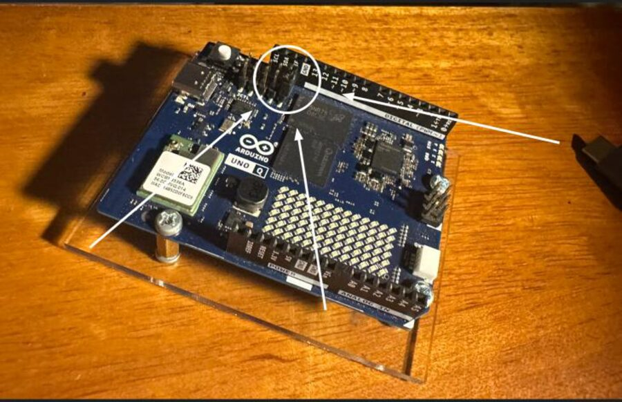

<!-- workshop-header -->


# 🆘 ติดตรงไหน เปิดอันนี้ก่อน

## 1) ต่อแล้วบอร์ดไม่ขึ้น / ไม่ boot

- เสียบสายถูกไหม / สายเสียไหม
- ต่อ Wi-Fi ได้ไหม (ถ้าได้ ใช้ผ่าน Wi-Fi เลยสะดวกกว่า)
- ⭐ **มี jumper pin เสียบค้างอยู่ไหม** — pin นี้ทำให้บอร์ด boot ไม่ขึ้น ถ้ามีให้ถอดออกก่อน (ดูตำแหน่งในวงกลม)



## 2) ต่อกล้อง/ไมค์ไม่ขึ้น หรือบอร์ดไม่เชื่อมสักที (รอนานมาก)

- ตอนใช้กล้อง/ไมค์ ให้ **บอร์ดอยู่บน Wi-Fi** + กล้อง/ไมค์เสียบ **powered USB hub** (hub ต้องเสียบสาย power ด้วย)
- ⚠️ **อย่าต่อบอร์ดเข้าคอมโดยตรงพร้อมใช้กล้อง** มันจะหากล้องไม่เจอ


- หาบอร์ดไม่เจอใน App Lab? → มักเพราะบอร์ดกับคอมคนละ Wi-Fi
  - ต่อบอร์ดเข้าคอมก่อน → App Lab → **Settings** → เลื่อนลงตั้ง SSID/PASSWORD ให้ตรงคอม → กลับไปต่อ Wi-Fi + hub ใหม่


## 3) edge-impulse-linux มีปัญหา

เปิด shell (`>_`) บนบอร์ด (ปุ่มมุมล่างซ้ายของ App Lab):


จากนั้นรัน:
```bash
nano run.sh
```
วางสคริปต์นี้:
```bash
curl -sL https://deb.nodesource.com/setup_20.x | sudo bash -
sudo apt install -y gcc g++ make build-essential nodejs sox \
  gstreamer1.0-tools gstreamer1.0-plugins-good \
  gstreamer1.0-plugins-base gstreamer1.0-plugins-base-apps
sudo npm install edge-impulse-linux -g --unsafe-perm
ls /dev/video*
arecord -l
```
`ctrl + x` → `y` → `enter` แล้ว `bash run.sh` จากนั้น `edge-impulse-linux`
(login เอา email/password จากหน้า Edge Impulse → account settings)

## ✨ ทำก่อนเรียกพี่เลี้ยง

1. ทำตามข้างบนครบหรือยัง?
2. **ถอดปลั๊กเสียบใหม่** แล้วดูผล

ยังไม่ได้จริงๆ → เรียกพี่เลี้ยง พร้อมบอกว่าค้าง step ไหน ลองอะไรไปแล้ว
